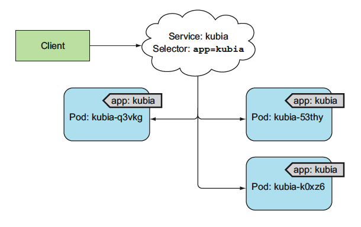

# 5장 서비스

- 쿠버네티스에서 서비스를 사용하는 이유
    - 파드는 일시적이다. 파드가 노드에서 제거되거나 다른 노드로 이동할 수 있다.
    - 쿠버네티스는 노드에 파드를 스케줄한 후 파드가 시작되기 바로 전에 파드의 IP 주소를 할당하기 때문에 클라이언트는 서버인 파드 IP 주소를 미리 알 수 없다.
    - 수평 스케일링은 여러 파드가 동일한 서비스를 제공할 수 있음을 의미한다. 모든 파드는 단일 IP 주소로 엑세스 할 수 있어야 한다.

## 5.1 서비스 소개

- 쿠버네티스 서비스는 동일한 서비스를 제공하는 파드 그룹에 지속적인 단일 접점을 만들려고 할 때 생성하는 리소스다.
- 각 서비스는 서비스가 존재하는 동안 절대 바뀌지 않는 IP 주소와 포트가 있다.
- 클라이언트는 해당 IP 와 포트로 접속한 다음 해당 서비스를 지원하는 파드 중 하나로 연결된다.
- 서비스의 클라이언트는 서비스를 제공하는 개별 파드의 위치를 알 필요 없으므로, 파드는 언제든지 클러스터 안에서 이동할 수 있다.

### 5.1.1 서비스 생성

- 서비스 연결은 서비스 뒷단의 모든 파드로 로드밸런싱 된다.
- 리플리케이션 컨트롤러와 기타 파드 컨트롤러에서 레이블 셀렉터를 사용해 동일한 세트에 속하는 파드를 지정하는 방법과 동일한 매커니즘이 서비스에도 그대로 사용된다.

- kubectl expose 로 서비스 생성
    - 서비스를 생성하는 가장 쉬운 방법
    - 

### 5.1.2 서비스 검색

## 5.2 클러스터 외부에 있는 서비스 연결

### 5.2.1 서비스 엔드포인트 소개

### 5.2.2 서비스 엔드포인트 수동 구성

### 5.2.3 외부 서비스를 위한 별칭 생성

## 5.3 외부 클라이언트에 서비스 노출

### 5.3.1 노트포트 서비스 사용

### 5.3.2 외부 로드밸런서로 서비스 노출

### 5.3.3 외부 연결의 특성 이해

## 5.4 인그레스 리소스로 서비스 외부 노출

### 5.4.1 인그레스 리소스 생성

### 5.4.2 인그레스로 서비스 액세스

### 5.4.3 하나의 인그레스로 여러 서비스 노출

### 5.4.4 TLS 트래픽을 처리하도록 인그레스 구성

## 5.5 파드가 연결을 수락할 준비가 됐을 때 신호 보내기

### 5.5.1 레디니스 프로브 소개

### 5.5.2 파드에 레디니스 프로브 추가

### 5.5.3 실제 환경에서 레디니스 프로브가 수행해야 하는 기능

## 5.6 헤드리스 서비스로 개별 파드 찾기

### 5.6.1 헤드리스 서비스 생성

### 5.6.2 DNS 로 파드 찾기

### 5.6.3 모든 파드 검색 - 준비되지 않은 파드도 포함

## 5.7 서비스 문제 해결
