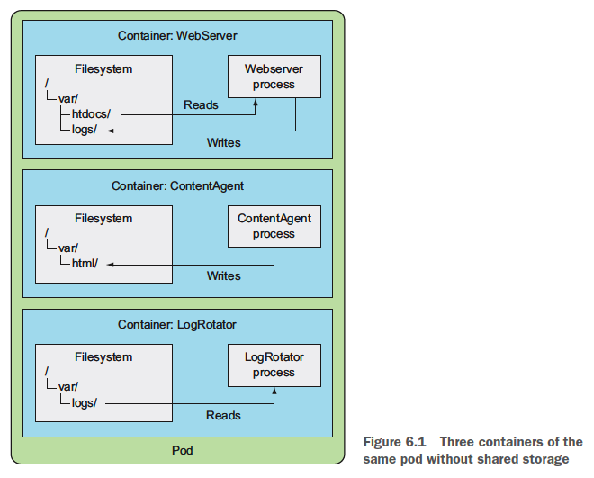
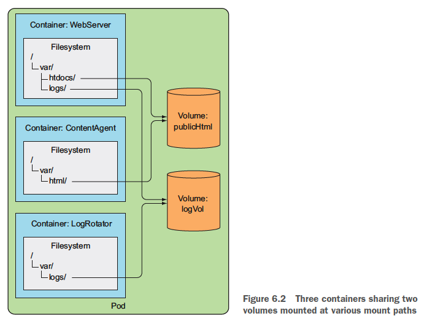

# 6장 볼륨: 컨테이너에 디스크 스토리지 연결

- 파드는 내부에 CPU, RAM, 네트워크 인터페이스 등의 리소스를 공유하는 논리적 호스트와 유사
- 파드 내부의 각 컨테이너는 각자의 파일 시스템을 가진다.
- 각 컨테이너간 데이터 공유를 위해 쿠버네티스는 스토리지 볼륨을 정의하는 방법으로 이 기능을 제공한다.
- 스토리지 볼륨은 파드와 같은 최상위 리소스는 아니지만 파드의 일부분으로 정의되며 파드와 동일한 라이프사이클을 가진다.

## 6.1 볼륨 소개

- 볼륨은 파드의 구성 요소로 독립적인 쿠버네티스 오브젝트가 이니므로 자체적으로 생성, 삭제될 수 없다.
- 볼륨은 파드의 모든 컨테이너에서 사용 가능하지만 접근하려는 컨테이너에서 각각 마운트 돼야 한다.

### 6.1.1 예제의 볼륨 설명

- 각 컨테이너는 잘 정의된 단일 책임을 갖고 있지만 각각 컨테이너 자체만으로는 큰 쓸모가 없다.

- 볼륨 두 개를 파드에 추가하고 세 개의 컨테이너 내부의 적절한 경로에 마운트 한다면 더 나은 시스템이 생성된다.

