# 6장 볼륨: 컨테이너에 디스크 스토리지 연결

- 파드는 내부에 CPU, RAM, 네트워크 인터페이스 등의 리소스를 공유하는 논리적 호스트와 유사
- 파드 내부의 각 컨테이너는 각자의 파일 시스템을 가진다.
- 각 컨테이너간 데이터 공유를 위해 쿠버네티스는 스토리지 볼륨을 정의하는 방법으로 이 기능을 제공한다.
- 스토리지 볼륨은 파드와 같은 최상위 리소스는 아니지만 파드의 일부분으로 정의되며 파드와 동일한 라이프사이클을 가진다.

## 6.1 볼륨 소개

- 볼륨은 파드의 구성 요소로 독립적인 쿠버네티스 오브젝트가 이니므로 자체적으로 생성, 삭제될 수 없다.
- 볼륨은 파드의 모든 컨테이너에서 사용 가능하지만 접근하려는 컨테이너에서 각각 마운트 돼야 한다.

### 6.1.1 예제의 볼륨 설명

- 각 컨테이너는 잘 정의된 단일 책임을 갖고 있지만 각각 컨테이너 자체만으로는 큰 쓸모가 없다.


- 볼륨 두 개를 파드에 추가하고 세 개의 컨테이너 내부의 적절한 경로에 마운트 한다면 더 나은 시스템이 생성된다.


- 쿠버네티스는 볼륨을 초기화하며 외부 소스의 내용을 채우거나 기존에 존재하는 디렉터리를 마운트 할 수 있다.
- 볼륨을 채우거나 마운트하는 프로세스는 파드의 컨테이너가 시작되기 전에 수행한다.

### 6.1.2 사용 가능한 볼륨 유형 소개

- 사용 가능한 볼륨 유형 목록
    - emptyDir: 일시적인 데이터를 저장하는 데 사용되는 간단한 빈 디렉터리
    - hostPath: 워커 노드의 파일스스템을 파드의 디렉터리로 마운트하는 데 사용
    - gitRepo: 깃 리포지터리의 콘텐츠를 체크아웃해 초기화한 볼륨
    - nfs: NFS 공유를 파드에 마운트한다
    - gcePersistentDisk(Google Compute Engine Persistent Disk), awsElasticBlockStore(Amazon Web Service Elastic Block Store Volume), azureDisk(Microsoft Azure Disk Volume): 클라우드 제공자 전용 스토리지
    - cinder, cephfs, iscsi, flocker, glusterfs, quobyte, rbd, flexVolume, vsphereVolume,photonPersistentDisk, scaleIO: 다른 유형의 네트워크 스토리지
    - configMap, secret, downwardAPI: 쿠버네티스 리소스나 클러스터 정보를 파드에 노출하는 데 사용되는 특별한 유형의 볼륨
    - persistentVolumeClaim: 사전에 혹은 동적으로 프로비저닝된 퍼시스턴트 스토리지를 사용하는 방법
- 특수한 유형의 볼륨(secret, downwardAPI, configMap)은 데이터를 저장하는데 사용되지 않고 쿠버네티스 메타데이터를 파드에 실행중인 애플리케이션에 노출하는 데 사용됨

## 6.2 볼륨을 사용한 컨테이너 간 데이터 공유

### 6.2.1 emptyDir 볼륨 사용

- 빈 디렉터리로 시작
- 파드에 실행중인 애플리케이션은 어떤 파일이든 볼륨에 쓸 수 있다.
- 볼륨의 라이프사이클이 파드에 묶여 있으므로 파드가 삭제되면 볼륨의 콘텐츠는 사라진다.
- 동일 파드에서 실행중인 컨테이너 간 파일을 공유할 때 유용하다.

- (여기서 부터 예제)

- emptyDir 은 파드를 호스팅하는 워크 노드의 실제 디스크에 생성되므로 노드 디스크가 어떤 유형인지에 따라 성능이 결정된다.
- 메모리를 사용하는 tmpfs 파일시스템으로 생성하도록 하려면 아래와 같이 `emptyDir` 의 `medium` 을 `Memory` 로 지정한다.

```yaml
  volumes:
  - name: html
    emptyDir:
      medium: Memory
```

### 6.2.2 깃 리퍼지터리를 볼륨으로 사용하기

- 현재는 deprecated 됐다. (https://kubernetes.io/docs/concepts/storage/volumes/#gitrepo)
- gitRepo 볼륨은 기본적으로 emptyDir 볼륨이며 파드가 시작되면 깃 리포지터리를 복제하고 특정 리비전을 체크아웃해 데이터로 채운다.

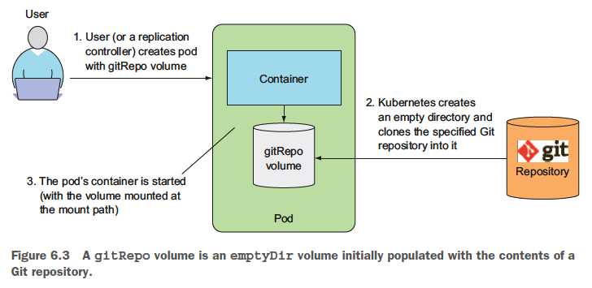

- gitRepo 볼륨이 생성된 후에는 참조하는 리포지터리와 동기화하지 않는다.
- 리플리케이션 컨트롤러가 파드를 관리하는 경우 파드를 삭제하면 새 파드가 생성되고 이 파드의 볼륨은 최신 커밋을 포함한다.

- (여기서 부터 예제)

- 사이드카 컨테이너 소개
    - 깃 동기화 프로세스가 Nginx 웹 서버와 동일 컨테이너에서 실행되면 안되며 두 번째 컨테이너인 사이드카(sidecar) 컨테이너에서 실행돼야 한다.
    - 사이드카 컨테이너는 파드의 주 컨테이너 동작을 보완한다.
- 프라이빗 깃 리포지터리로 gitRepo 볼륨 사용하기
    - 프라이빗 깃 리포지터리로 gitRepo 볼륨을 사용할 수 없기 때문에 프라이빗 깃 리포지터리를 사용하기 위해선 사이드카 컨테이너를 사용해야 한다.

## 6.3 워커 노드 파일시스템의 파일 접근

- 대부분의 파드는 호스트 노드를 인식하지 못하므로 노드의 파일시스템에 있는 어떤 파일에도 접근하면 안 된다.
- 특정 시스템 레벨의 파드(보통 데몬셋으로 관리되는 것)는 노드의 파일을 읽거나 파일시스템을 통해 노드 디바이스를 접근하기 위해 노드의 파일 시스템을 사용한다.
- 쿠버네티스는 hostPath 볼륨으로 가능하게 한다.

### 6.3.1 hostPath 볼륨 소개

- hostPath 볼륨은 노드 파일시스템의 특정 파일이나 디렉터리를 가리킨다.
- 동일 노드에 실행 중인 파드가 hostPath 볼륨의 동일 경로를 사용 중이면 동일한 파일이 표시된다.

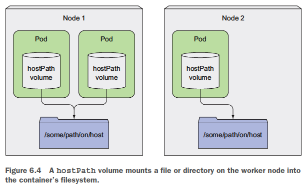

- hostPath 볼륨은 파드가 종료되어도 콘텐츠는 삭제되지 않는다.
- hostPath 볼륨은 파드가 어떤 노드에 스케줄링되느냐에 따라 민감하기 때문에 일반적인 파드에 사용하는 것은 좋은 생각이 아니다.

### 6.3.2 hostPath 볼륨을 사용하는 시스템 파드 검사하기

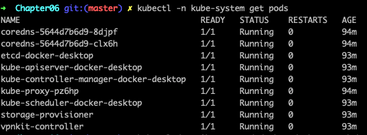

```shell script
$ kubectl describe po etcd-docker-desktop -n kube-system
```

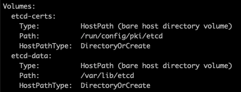

- 노드의 시스템 파일에 읽기/쓰기를 하는 경우에만 hostPath 볼륨을 사용한다.
- 여러 파드에 걸쳐 데이터를 유지하기 위해서는 절대 사용하면 안된다.

## 6.4 퍼시스턴스 스토리지 사용

- 파드가 다른 노드로 재 스캐줄링된 경우에도 동일한 데이터를 사용해야 한다면 어떤 노드에서도 접근이 필요하기 때문에 NAS(Network-Attached Storage) 유형에 저장돼야 한다.

### 6.4.1 GCE 퍼시스턴트 디스크를 파드 볼륨으로 사용하기

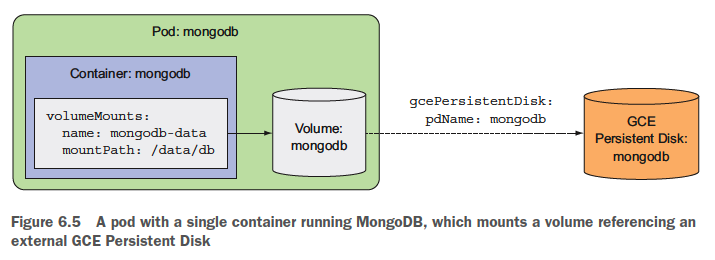

```shell script
$ kubectl create -f mongodb-pod-hostpath.yaml
```

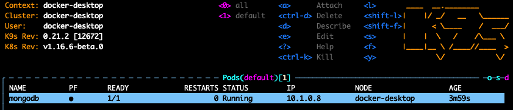

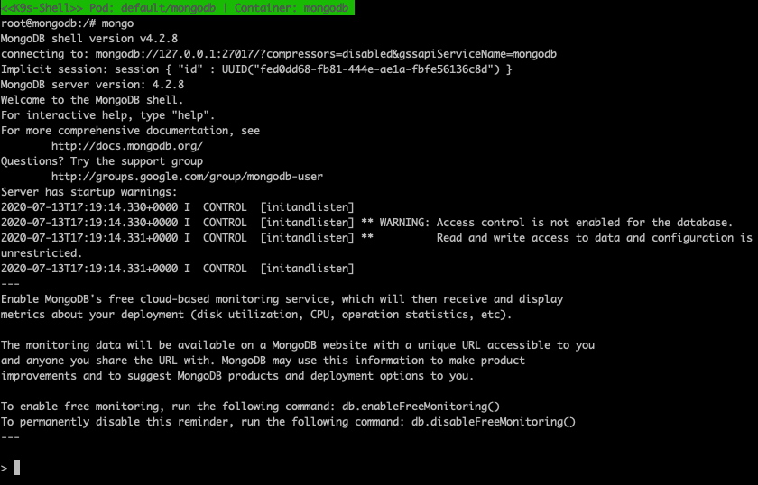

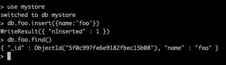

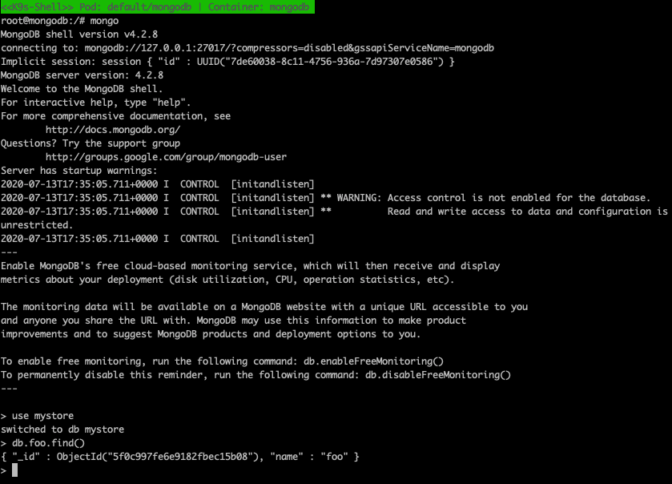

### 6.4.2 기반 퍼시스턴스 스토리지로 다른 유형의 볼륨 사용하기

- 예제는 생략
- 쿠버네티스가 지원하는 각 볼륨 유형별로 필요한 속성의 세부 정보를 보려면 쿠버네티스 API 레퍼런스의 API 정의를 확인하거나 `kubeclt explain` 을 통해 정보를 찾아봐야 한다.
- 인프라스트럭처 관련 정보를 파드 정의에 포함하면 동일한 파드 정의를 다른 클러스터에서는 사용할 수 없다.
- 볼륨을 이런 방식으로 사용하는 것이 파드에 퍼시스턴트 스토리지를 연결하는 최적의 방법이 아닌 이유

## 6.5 기반 스토리지 기술과 파드 분리

- NFS 기반 볼륨을 생성하려면 개발자는 NFS 익스포트가 위치하는 실제 서버를 알아야 한다.
- 이는 애플리케이션과 개발자로부터 실제 인프라스트럭처를 숨긴다는 쿠버네티스의 기본 아이디어에 반한다.
- 개발자가 애플리케이션을 위해 일정량의 퍼시스턴트 스토리지를 필요로 하면 쿠버네티스에 요청할 수 있어야 하고, 동일한 방식으로 파드 생성 시 CPU, 메모리와 다른 리소스를 요청할 수 있어야 한다.

### 6.5.1 퍼시스턴트 볼륨과 퍼시스턴트 볼륨클레임 소개

- 인프라스트럭처의 세부 사항을 처리하지 않고 애플리케이션이 쿠버네티스 클러스터에 스토리지를 요청할 수 있도록 하기 위해 새로 도입된 리소스

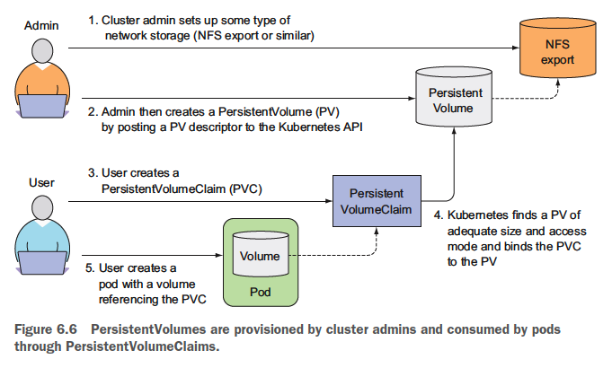

- 클러스터 관리자가 기반 스토리지를 설정하고 쿠버네티스 API 서버로 퍼시스턴트 볼륨 리소스를 생성해 쿠버네티스에 등록한다.
- 퍼시스턴트 볼륨이 생성되면 관리자는 크기와 지원 가능한 접근 모드를 지정한다.
- 클러스터 사용자가 파드에 퍼시스턴트 스토리지를 사용해야 하면 먼저 최소 크기와 필요한 접근 모드를 명시한 퍼시스턴트 볼륨클레임 매니페스트를 생성한다.
- 그 다음 사용자는 퍼시스턴트 볼륨클레임 매니페스트를 쿠버네티스 API 서버에 게시하고 쿠버네티스는 적절한 퍼시스턴트 볼륨을 찾아 클레임에 볼륨을 바인딩한다.
- 그 다음 퍼시스턴트 볼륨클레임은 파드 내부의 볼륨 중 하나로 사용될 수 있다.
- 퍼시스턴트 볼륨클레임의 바인딩을 삭제하기 전까지 다른 사용자는 동일한 퍼시스턴트 볼륨을 사용할 수 없다.

### 6.5.2 퍼시스턴트 볼륨 

```yaml
apiVersion: v1
kind: PersistentVolume
metadata:
  name: mongodb-pv
spec:
  capacity: 
    storage: 1Gi
  accessModes:
    - ReadWriteOnce
    - ReadOnlyMany
  persistentVolumeReclaimPolicy: Retain
  hostPath:
    path: /tmp/mongodb
```

```shell script
$ kubectl create -f mongodb-pv-hostpath.yaml
```

- 퍼시스턴트 볼륨을 생성할때 관리자가 해야 하는일
    - 쿠버네티스에게 용량이 얼마가 되는지 단일 노드나 동시에 다수 노드에 읽기나 쓰기가 가능한지 여부를 알려야 한다.
    - 쿠버네티스에게 퍼시스턴트 볼륨이 해제되면 어떤 동작을 해야 할지 알려야 한다.
    - 퍼시스턴트 볼륨을 지원하는 실제 스토리지의 유형, 위치, 그 밖의 속성 정보를 지정해야 한다.


- 퍼시스턴트 볼륨은 특정 네임스페이스에 속하지 않는다.
- 퍼시스턴트 볼륨은 노드와 같은 클러스터 수준 리소스다.

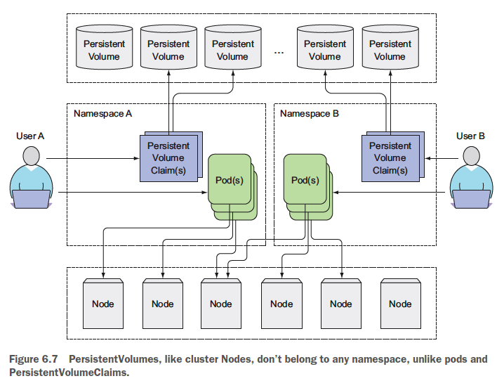

### 6.5.3 퍼시스턴트 볼륨클레임 생성을 통한 퍼시스턴트 볼륨 요청

```yaml
apiVersion: v1
kind: PersistentVolumeClaim
metadata:
  name: mongodb-pvc 
spec:
  resources:
    requests:
      storage: 1Gi
  accessModes:
  - ReadWriteOnce
  storageClassName: ""
```

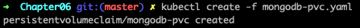

- 퍼시스턴트 볼륨클레임이 생성되자마자 쿠버네티스는 적절한 퍼시스턴트 볼륨을 찾고 클레임에 바인딩한다.
- 퍼시스턴트 볼륨 용량은 퍼시스턴트 볼륨클레임의 요청을 수용할만큼 충분히 커야 한다.
- 볼륨 접근 모드는 클레임에서 요청한 접근 모드를 포함해야 한다.


- 접근 모드
    - RWO(ReadWriteOnce): 단일 노드만이 읽기/쓰기용으로 볼륨을 마운트할 수 있다.
    - ROX(ReadOnlyMany): 다수 노드가 읽기용으로 볼륨을 마운트할 수 있다.
    - RWX(ReadWriteMany): 다수 노드가 일기/쓰기용으로 볼륨을 마운트할 수 있다.


- 퍼시스턴트 볼륨은 클러스터 수준의 리소스이므로 특정 네임스페이스에 생성할 수 없다.
- 퍼시스턴트 볼륨클레임은 특정 네임스페이스에 생성해야만 한다. (번역 누락됨)
- 퍼시스턴트 볼륨클레임은 동일한 네임스페이스에 있는 파드만 사용할 수 있다.

### 6.5.4 파드에서 퍼시스턴트 볼륨클레임 사용하기

- 볼륨을 해제할 때까지 다른 사용자는 동일한 볼륨에 클레임을 할 수 없다.

```yaml
apiVersion: v1
kind: Pod
metadata:
  name: mongodb 
spec:
  containers:
  - image: mongo
    name: mongodb
    volumeMounts:
    - name: mongodb-data
      mountPath: /data/db
    ports:
    - containerPort: 27017
      protocol: TCP
  volumes:
  - name: mongodb-data
    persistentVolumeClaim:
      claimName: mongodb-pvc
```

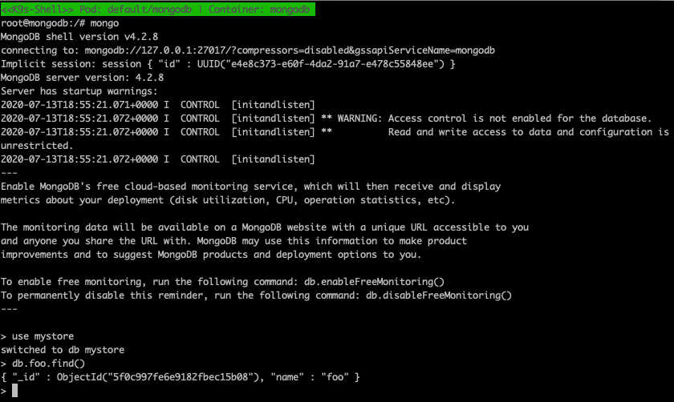

### 6.5.5 퍼시스턴트 볼륨과 퍼시스턴트 볼륨클레임 사용의 장점 이해하기

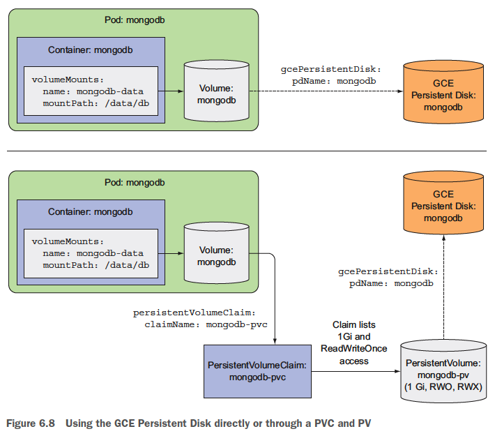

- 개발자는 기저에 사용된 실제 스토리지 기술을 알 필요가 없다.
- 파드와 클레임 매니페스트는 인프라스트럭처와 관련된 어떤 것도 참조하지 않으므로 다른 쿠버네티스 클러스터에서도 사용할 수 있다.

### 6.5.6 퍼시스턴트 볼륨 

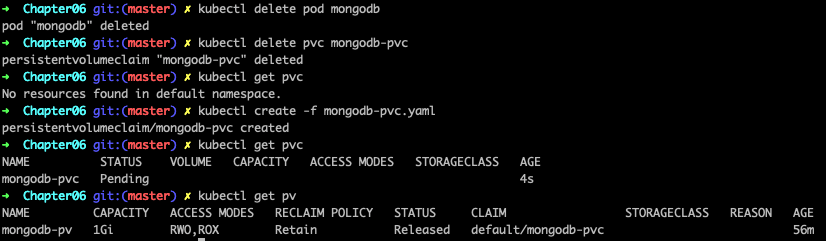

- 이미 볼륨을 사용했기 때문에 데이터를 가지고 있으므로 클러스터 관리자가 볼륨을 완전히 비우지 않으면 새로운 클레임에 바인딩할 수 없다.
- 클러스터 관리자가 볼륨을 비우지 않았다면 동일한 퍼시스턴트 볼륨을 사용하는 새 파드는 다른 네임스페이스에서 클레임과 파드가 생성됐다고 할지라도 이전 파드가 저장한 데이터를 읽을 수 있다.

#### 퍼시스턴트 볼륨을 수동으로 다시 클레임하기

- 쿠버네티스에 `persistentVolumeClaimPolicy` 를 `Retain` 으로 설정하면 퍼시스턴트 볼륨이 이런 동작을 할 수 있다.
- 쿠버네티스가 클레임이 해제돼도 볼륨과 콘텐츠를 유지하도록 한다.
- 퍼시스턴트 볼륨을 수동으로 재사용할 수 있는 유일한 방법은 퍼시스턴트 볼륨 리소스를 삭제하고 다시 생성하는 것이다.
    - 기반 스토리지 파일을 삭제할 수도 있고 남겨들 수도 있다.

#### 퍼시스턴트 볼륨을 자동으로 다시 클레임하기

- 리클레임 정책: Recycle, Delete
    - Recycle: 볼륨의 콘텐츠를 삭제하고 볼륨이 다시 클레임될 수 있도록 볼륨을 사용 가능하게 만든다. (Recycle 옵션은 현재 GCE 퍼시스턴트 디스크에서 사용할 수 없다)
    - Delete: 기반 스토리지를 삭제한다.
- 기존 퍼시스턴트 볼륨의 리클레임 정책을 변경할 수 있다.

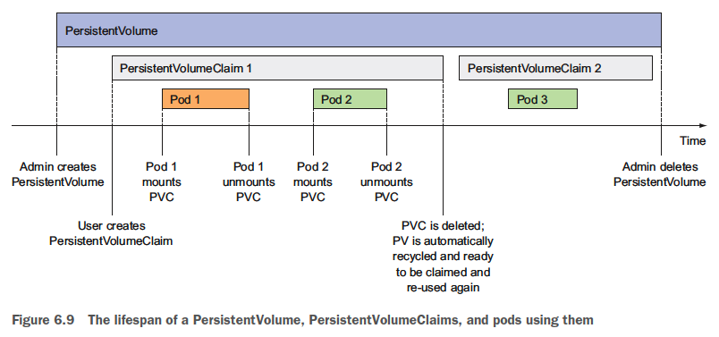

## 6.6 퍼시스턴트 볼륨의 동적 프로비저닝

### 6.6.1 스토리지클래스 리소스를 통한 사용 가능한 스토리지 유형 정의하기

### 6.6.2 퍼시스턴트 볼륨클레임에서 스토리지 클래스 요청하기

### 6.6.3 스토리지 클래스를 지정하지 않은 동적 프로비저닝

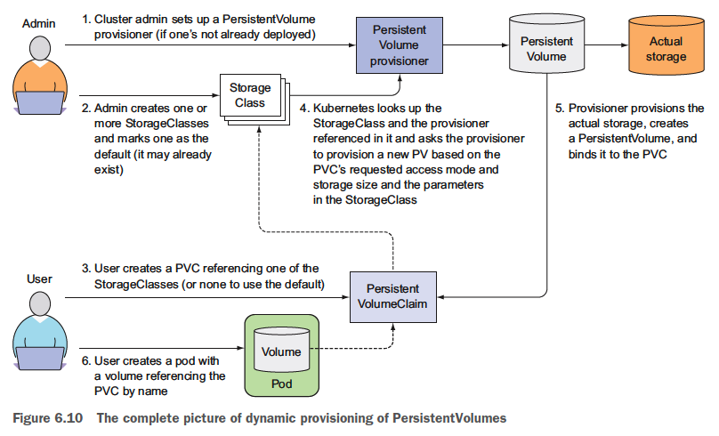
